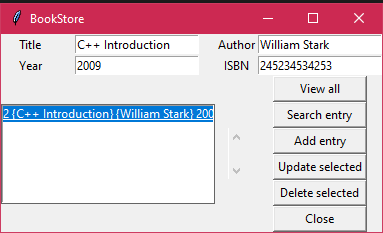

# TABLE OF CONTENT

* [Project description](#project-description)
* [Dependencies](#dependencies)
* [Screenshots](#screenshots)

## Project Description

This bookstore management store book information including title, author, year, ISBN.

GUI is built with Tkinter.

User should be able to:

* View all records
* Search an entry
* Add entry
* Update selected
* Delete selected
* Close the program

## Dependencies

* Tkinter
* SQLite

## Screenshots

